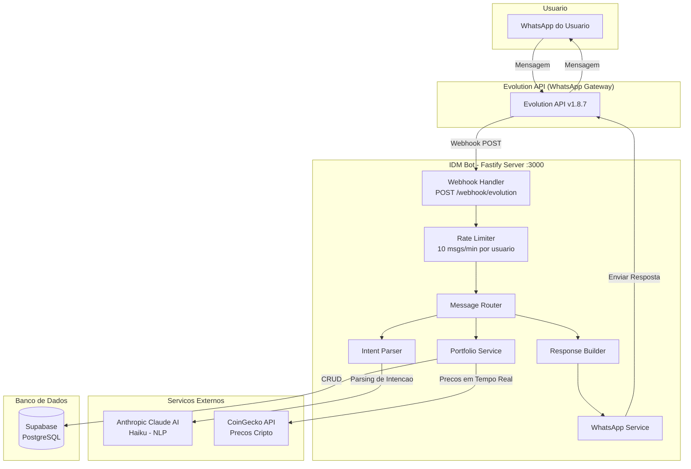
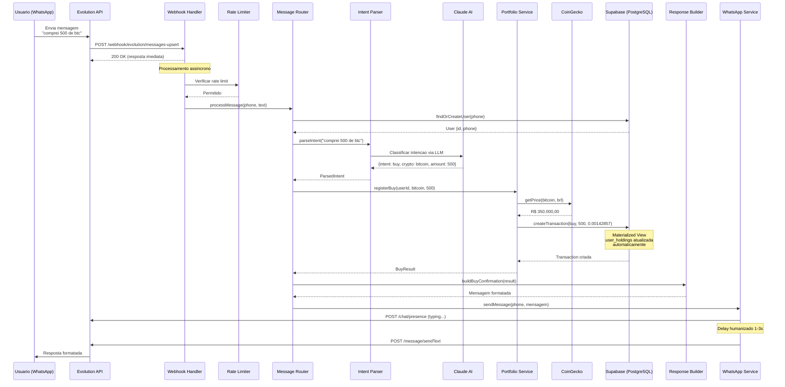
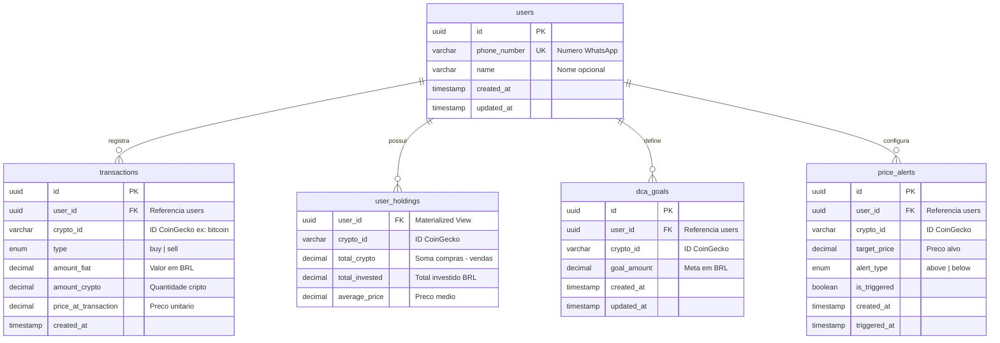
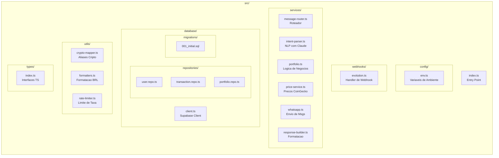
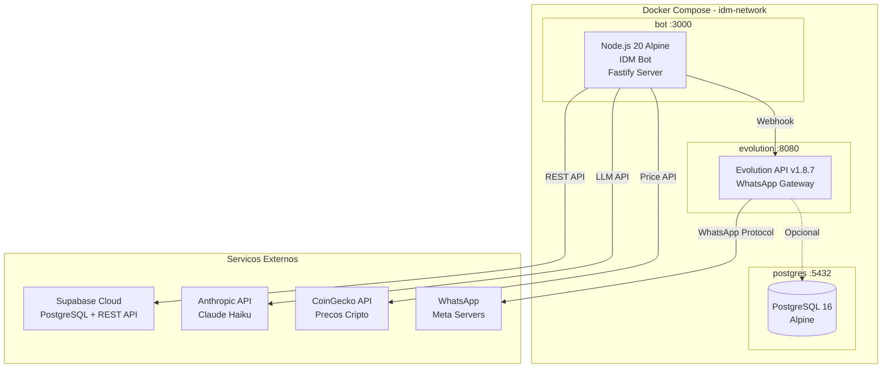
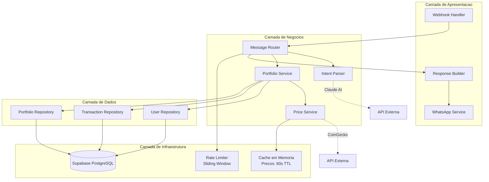

# IDM ZapZap - Diagrama de Arquitetura

## Visao Geral do Sistema

Bot de WhatsApp para rastreamento de portfolio de criptomoedas, construido com Node.js/TypeScript, usando Claude AI para processamento de linguagem natural.

---

## Arquitetura Geral

---

## Fluxo de Processamento de Mensagens

---

## Modelo de Dados (Banco de Dados)

---

## Estrutura de Diretorios

---

## Intencoes Suportadas (Comandos do Bot)

```mermaid
graph TD
    MSG[Mensagem do Usuario] --> IP3[Intent Parser]

    IP3 --> BUY[buy<br/>Registrar compra<br/>'comprei 500 de btc']
    IP3 --> SELL[sell<br/>Registrar venda<br/>'vendi 0.5 eth por 5000']
    IP3 --> PORT2[portfolio_summary<br/>Ver carteira<br/>'carteira / portfolio']
    IP3 --> ASSET[asset_detail<br/>Detalhe do ativo<br/>'quanto tenho de btc']
    IP3 --> PCHK[price_check<br/>Verificar preco<br/>'preco do eth']
    IP3 --> REM[remove_asset<br/>Remover ativo<br/>'zerar posicao btc']
    IP3 --> SDCA[set_dca_goal<br/>Definir meta DCA<br/>'meta 10000 em btc']
    IP3 --> PDCA[dca_progress<br/>Progresso metas<br/>'progresso / metas']
    IP3 --> PROJ[projection<br/>Projecao 12 meses<br/>'projecao']
    IP3 --> ALERT[set_alert<br/>Alerta de preco<br/>'alerta btc acima 500k']
    IP3 --> HELP[help<br/>Ajuda<br/>'ajuda / comandos']
    IP3 --> UNK[unknown<br/>Nao reconhecido]

    style BUY fill:#2d6a4f,color:#fff
    style SELL fill:#d62828,color:#fff
    style PORT2 fill:#1d3557,color:#fff
    style ASSET fill:#457b9d,color:#fff
    style PCHK fill:#e9c46a,color:#000
    style REM fill:#9b2226,color:#fff
    style SDCA fill:#606c38,color:#fff
    style PDCA fill:#283618,color:#fff
    style PROJ fill:#6a4c93,color:#fff
    style ALERT fill:#f4a261,color:#000
    style HELP fill:#264653,color:#fff
    style UNK fill:#6c757d,color:#fff
```

---

## Infraestrutura Docker

---

## Camadas da Arquitetura

---

## Stack Tecnologica

| Camada | Tecnologia | Proposito |
|--------|-----------|-----------|
| **Runtime** | Node.js 20 | Ambiente de execucao |
| **Linguagem** | TypeScript 5.7 | Tipagem estatica |
| **HTTP Server** | Fastify 5.2 | Servidor web leve |
| **Banco de Dados** | Supabase (PostgreSQL) | Persistencia de dados |
| **NLP/AI** | Anthropic Claude Haiku | Parsing de intencoes |
| **WhatsApp** | Evolution API v1.8.7 | Gateway WhatsApp |
| **Precos** | CoinGecko API | Cotacoes de cripto |
| **Testes** | Vitest | Testes unitarios |
| **Container** | Docker + Compose | Deploy e orquestracao |

---

## Criptomoedas Suportadas

30+ criptomoedas com aliases em portugues:

**Majors:** BTC, ETH, SOL, BNB, ADA, XRP, DOT, AVAX, LINK
**DeFi:** UNI, AAVE, MATIC
**Layer 2:** ARB, OP
**Alt L1:** NEAR, APT, SUI
**Meme:** DOGE, SHIB, PEPE
**Stablecoins:** USDT, USDC
**Outros:** LTC, ATOM, XLM, XMR, TRX, RNDR, INJ, SEI, JUP
